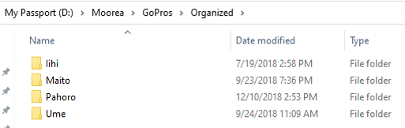
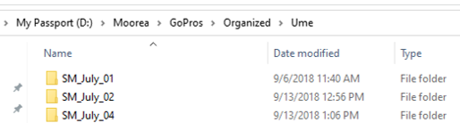
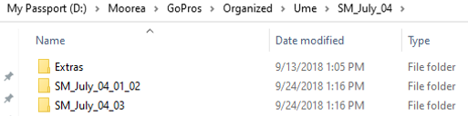
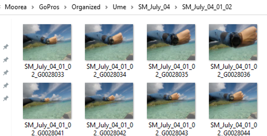

# Paired, georeferenced fish and benthic surveys
Contains code and documentation to process and validate data collected using the GPS-enabled, paired fish and benthic surveys described in ______.  It is assumed that the reader has read this paper and supplement because some terminology is used that is not repeated here.  Raw data from the two example transects highlighted in the paper are included to allow the reader to see how the different scripts interact.

---

## Step 0. Ensure data are in the correct format
Although these scripts can be modified to fit specific goals or workflows, as they are written, they assume that data were collected according to the companion paper and that certain pre-processing steps were taken.

1. Photographs should be organized as follows: "root" folder --> "camera" folder --> "date" folder --> "foray" folder.
  - "root" folder contains all the "camera" folders.  In this example, our "root" folder is "Organized".

  - "camera" folders each contain all the sub-folders collected by each individual camera (we used 4 cameras in our field season, so we have 4 "camera" folders)

  - "date" folders are one step below "camera" folders and contain all the "forays" completed on each day by each observer on that camera

  - "foray" folders contain all photographs collected in each trip from the boat (i.e., off a single timelapse).  Multiple transects can be included in one "foray", but they need to be grouped together to ensure the georeferencing works properly.  These should begin with a clear photograph of the watch face.  Photographs before this first clear image can be placed in a separate folder inside the "date" folder (we called ours "Extra").

.

2. The time from the watch in the first photograph of each foray should be saved in a .csv (in our case, watchData.csv).  The "Folder" column should refer to the folder directly containing all the images for that foray, and the "Track" column should contain the entire GPS track name, including the .gpx at the end.

3. All GPS tracks should be in a single folder.

---

## Step 1. Associating images with time and GPS coordinates
These are the steps required to take these images, associate them with a time based on the time visible on the watch face at the beginning of each foray, then associate these times with coordinates from the GPS tracks.

1. Photographs need to be renamed when large numbers are used.  Assuming a GoPro was used with the default naming scheme, there is bound to be some duplicate names of photographs across the dataset.  To do this, you can use the batchRename.R script to automatically assign each photograph a unique name.  It does so by adding the name in the "Folder" field to the front of the image name. **NOTE: This will permanently change the names of your images.  It is highly recommended that the photographs are backed up at some point prior to this step if they have not been already.**  
2. Once photographs are named something unique, the next step is to actually generate the time and coordinate metadata for each photograph.  To do this, open the timeLapseTimer.R script and change the five fields at the top.  This may take some time to run, but the end result is a dataframe with each row representing an individual photograph, and the time and coordinates from the GPS tracks associated with them.
3. 
